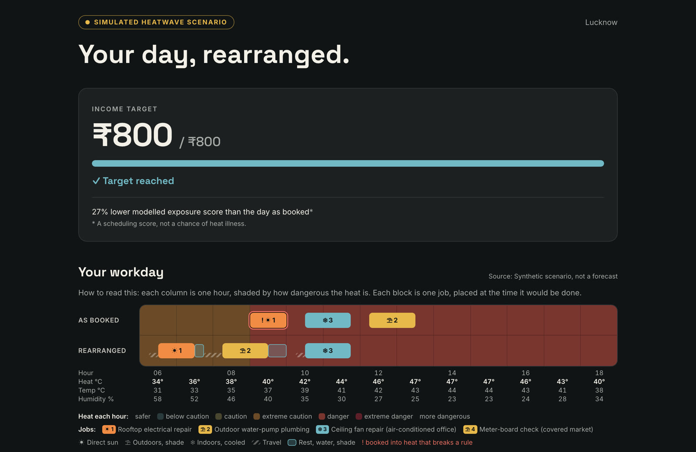
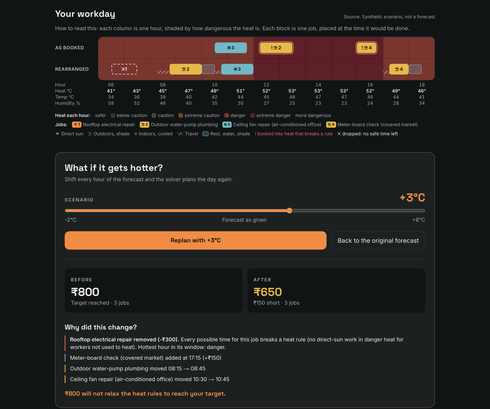
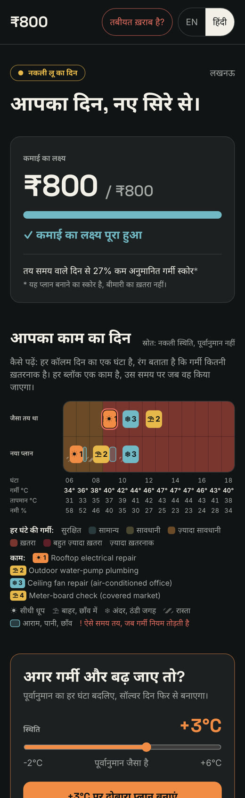

# ₹800

**Plan the workday around the heat, not against the paycheck.**

₹800 is a heat-aware work planner for outdoor workers in India who can't afford to take the day off in a heatwave. An electrician enters (or says in Hindi) the jobs they actually have today, with pay, time window and sun or shade. A constraint solver (Google OR-Tools CP-SAT on AWS Lambda) rearranges the day around the hourly heat index. Rooftop work moves to 06:30, cooled indoor work takes the hottest hours, and travel and rest are scheduled as real blocks. If the income target can't be reached without breaking a heat rule, it says so and shows the exact shortfall and the reason for every dropped job. It never relaxes a rule to make the money work.

[](https://www.youtube.com/watch?v=xtvfS-8Q3ro)

| | |
|---|---|
| **Demo video** | https://www.youtube.com/watch?v=xtvfS-8Q3ro (2:04) |
| **Live app** | https://main.d231iqub8spohk.amplifyapp.com |
| **API health** | https://4l3js7p5ub.execute-api.us-east-1.amazonaws.com/api/v1/health |
| **Event** | WeMakeDevs × AWS Environmental Hacks 2026, Heat & Water track |

## Run it locally

Backend (Python 3.12):

```bash
cd services/api
python3.12 -m venv .venv
./.venv/bin/pip install -r requirements.txt -r requirements-dev.txt
./.venv/bin/python -m pytest -q
./.venv/bin/uvicorn app.main:app --port 8000
```

Frontend (Node 22), in a second terminal:

```bash
cd apps/web
npm install
npm run dev
```

Open http://localhost:3000, click **Explore the heatwave example**, then **Generate work plan**, then **Replan with +3°C**.

Locally, plans are kept in memory unless `PLANS_TABLE` is set. Reading jobs from speech or text needs `MODAL_API_KEY` (or AWS credentials with Bedrock access). Everything else works offline with no AWS account.

## What you'll see

**1. The day, rearranged.** The top row is the day as booked, the bottom row is the solver's plan. Each column is one hour, shaded by heat-index band. The rooftop job (☀1) was booked for 09:00, already in the danger band, so it moves to 06:30. Travel (hatched) and rest (blue) are explicit blocks.



**2. Make it hotter.** Slide the forecast up and the backend re-solves from scratch. At +3 °C every rooftop slot breaks the direct-sun rule, so that job is gone (✕1). The plan falls to ₹650 and explains each change.



**3. In Hindi, on a budget phone.** The whole UI switches to Hindi. The **Feeling unwell?** button is on every screen and shows guidance to stop work and get help (108, 112).

<p align="center"></p>

### The demo transitions

These numbers come from the solver. A unit test fails if any of them change.

| Forecast | Income | What happens |
|---|---|---|
| +0 °C | ₹800 of ₹800 | Rooftop job moves 09:00 → 06:30. Exposure score 27% lower than the day as booked. |
| +3 °C | ₹650 (₹150 short) | Rooftop job removed: every slot breaks the direct-sun rule. |
| +5 °C | ₹250 | The air-conditioned job also drops (getting there means travelling in extreme danger) and the meter job drops (no safe slot leaves time to rest before the workday ends). |

## How it decides

1. Every 15-minute slot gets an NWS heat-index band from the forecast (demo: a labelled synthetic Lucknow heatwave; live: Open-Meteo).
2. Hard rules remove slots:
   - **Extreme danger:** no work outside a cooled room and no travel between jobs.
   - **Danger:** no heavy work, and no direct-sun work for anyone not used to heat (the default when unsure).
   - **Rest:** the rest block after an outdoor job must end inside the working hours.
3. CP-SAT solves in three lexicographic phases:
   - maximize income from the worker's own jobs
   - then minimize the modelled exposure score while keeping that income
   - then stay as close as possible to the booked times

   Jobs never overlap, travel and rest are explicit intervals and fixed appointments never move.
4. An independent validator re-checks every solution before it is returned.
5. "As booked" is the same jobs at their booked times with no heat rules. The percentage compares those two scores.

The language model only turns speech into draft job cards, which the worker confirms field by field. It never decides timing or safety.

Full rules, weights and limits: `/methodology` in the app, or [`services/api/app/policy.py`](services/api/app/policy.py).

## Architecture on AWS

```text
Browser (Next.js static export, EN / हिंदी)
   │  HTTPS
Amplify Hosting ──► API Gateway HTTP API (throttled 10 rps)
                        │
                    AWS Lambda: FastAPI + Mangum
                    ├─ weather.py     demo fixture or Open-Meteo, +ΔT scenario copy
                    ├─ heat_index.py  NWS Rothfusz heat index, screening bands
                    ├─ policy.py      hard rules, rest blocks, exposure weights
                    ├─ optimizer.py   CP-SAT: max income → min exposure → min drift
                    ├─ parse_jobs.py  Modal GLM 5.3 (OpenAI-compatible) or Bedrock → draft jobs
                    └─ store.py       DynamoDB plans, 7-day TTL
                        │
                    CloudWatch: plan_generated / plan_recalculated JSON events
```

| Service | Role |
|---|---|
| **AWS Lambda** | FastAPI and OR-Tools CP-SAT, zip deploy. Typical solve takes 50 to 250 ms. |
| **API Gateway HTTP API** | Public API with stage throttling and CORS. |
| **DynamoDB** | Every plan and replan, linked by `parent_plan_id` and stored with its diff. 7-day TTL. |
| **CloudWatch** | Structured `plan_generated`, `plan_recalculated` and `jobs_parsed` events. |
| **Amplify Hosting** | Static Next.js site. |
| **Bedrock** | Fallback provider for job reading. The primary is GLM 5.3 on Modal. |

| Endpoint | Purpose |
|---|---|
| `POST /api/v1/plans/optimize` | Solve a day from target, hours, jobs and weather mode |
| `POST /api/v1/plans/{id}/simulate` | Re-solve the same inputs with the forecast shifted by -2 to +6 °C, returns a diff |
| `GET /api/v1/plans/{id}` | Fetch a stored plan |
| `POST /api/v1/jobs/parse` | Hindi or English text to draft jobs via Modal (Bedrock fallback) |
| `GET /api/v1/weather` | Annotated hourly weather (demo or live) |
| `GET /api/v1/methodology` | Policy version, rules, weights and limits |
| `GET /api/v1/health` | Health and storage backend |

## Deploy to AWS

```bash
./infrastructure/deploy.sh       # DynamoDB, IAM role, Lambda (zip via S3), API Gateway HTTP API; prints API_URL
echo "NEXT_PUBLIC_API_URL=<API_URL>" > apps/web/.env.production
./infrastructure/deploy-web.sh   # static Next.js export to Amplify Hosting; prints WEB_URL
```

Both scripts are idempotent and need only the AWS CLI and Python 3.12 (no Docker). OR-Tools Linux wheels unzip to about 158 MB, under Lambda's 250 MB limit. `CODE_ONLY=1 ./infrastructure/deploy.sh` updates the function code and keeps its environment.

| Variable | Where | Purpose |
|---|---|---|
| `NEXT_PUBLIC_API_URL` | `apps/web/.env.production` | API Gateway base URL, no trailing slash |
| `PLANS_TABLE` | Lambda (set by `deploy.sh`) | DynamoDB table for plans |
| `ALLOWED_ORIGINS` | Lambda (set by `deploy.sh`) | Comma-separated CORS origins |
| `BEDROCK_MODEL_ID` | Lambda (set by `deploy.sh`) | Fallback model for job reading, default Claude Haiku 4.5 |
| `MODAL_API_KEY` | your shell before `deploy.sh` | If set, job reading uses a Modal-hosted model (OpenAI-compatible API) instead of Bedrock |
| `MODAL_BASE_URL`, `MODAL_MODEL` | your shell before `deploy.sh` | Optional. Default to `https://inference.us-west.modal.direct/v1` and the GLM 5.3 endpoint |

## Tests

```bash
cd services/api && ./.venv/bin/python -m pytest -q
```

31 tests cover:

- **Solver basics:** income sums, fixed-appointment overlap, availability windows, shortfall, determinism, empty input and input validation.
- **Heat rules:** heavy-work bans, travel never in extreme danger, rest ending inside the workday and the target never relaxing a rule.
- **Robustness:** scenario copies never mutate the source forecast, travel and rest never overlap and a solver timeout still returns a valid plan.
- **Storage and parsing:** replans are stored with their diff, and Modal and Bedrock job parsing both work.
- **Demo numbers:** ₹800 at +0 °C, ₹650 at +3 °C with only the rooftop job removed and ₹250 at +5 °C.

## Repository layout

```text
apps/web/            Next.js 16 app (landing, job entry, plan, simulator, methodology), EN and Hindi
services/api/app/    FastAPI service: solver, heat index, policy, job parsing, storage
services/api/tests/  pytest suite
infrastructure/      deploy.sh (Lambda, API Gateway, DynamoDB) and deploy-web.sh (Amplify)
docs/                submission write-up, demo script, screenshots
videos/rs800-demo/   demo video source: Playwright recorder, VHS tape, cut script, HyperFrames storyboard
```

## Limits

This is a scheduling prototype, not a certified occupational safety assessment. The heat rules and exposure weights are prototype guardrails and ranking coefficients, not validated thresholds or a medical risk. The heat index is a shade-based screening value, not WBGT, and a forecast is not an onsite measurement. Demo weather and jobs are synthetic and labelled on every screen.

## Data and credits

- Weather: [Open-Meteo](https://open-meteo.com) (CC BY 4.0). Heat index: US National Weather Service Rothfusz regression.
- Hero images are AI-generated (OpenAI image generation via Codex CLI).
- Demo video: real screen recordings of the live app and AWS CLI, edited with HyperFrames, narrated with HeyGen text to speech.
- AI coding tools used: Claude Code (Claude Opus 5.5) for code and docs, Codex CLI for images.

## License

[MIT](LICENSE)
